# Компьютерная графика. Лабораторная работа №3

Солодуха Дмитрий, 13 группа

## Задание

Написать приложение/веб-приложение для реализации алгоритмов и методов обработки изображений:

- Локальная пороговая обработка
    - Метод Ниблака
    - Метод Бернсена
- Адаптивная пороговая обработка
- Реализация высокочастотных фильтров (увеличение резкости)

## Реализация

Приложение было реализовано на языке `Python` с использованием библиотек для работы с изображениями `OpenCV`, `skimage`.

## Установка

### Если есть интерпретатор

```shell
git clone https://github.com/sMeDDveD/ComputerGraphicsLab3.git
cd ComputerGraphicsLab3
python -m venv env && env\Scripts\activate
pip install -r requirements.txt
python app\main.py
```

### Если все плохо

Здесь должна появится [ссылка](https://www.youtube.com/watch?v=dQw4w9WgXcQ)

## Описание

Интерфейс позволяет пользователю загрузить необходимое изображение и использовать необходимую ему функциональность. Для
этого он может выбрать подходящий метод бинаризации или фильтр и нажать соответствующую кнопку. Пример работы приложения
с загруженным изображением: 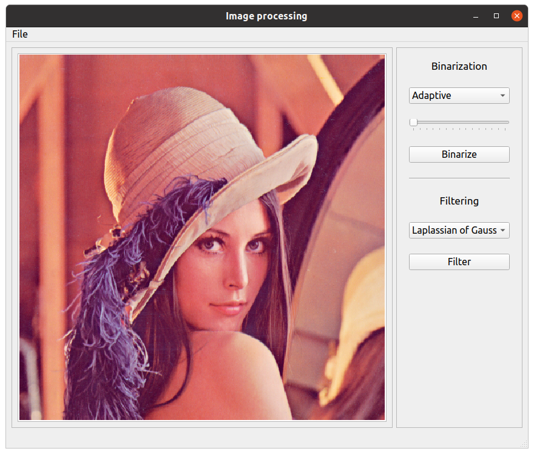

### Бинаризация

Для сравнения методов были подобраны разноплановые картинки: шумные, низкоконтрасные, с множеством маленьких объектов и
наоборот. В целом стоит отметить, что практически во всех случаях лучше всего проявлял себя адаптивный метод Гаусса, а
следом за ним метод Бернсена. Метод Ниблака практически никак себя не проявил, но возможно, что для него просто нужна
более тонкая настройка параметров.

#### Примеры бинаризации

##### Адаптивный метод

Больше всего преимуществ адаптивного метода проявляется при работе с зашумленными изображениями, в которых некоторые
части изображения темнее других.
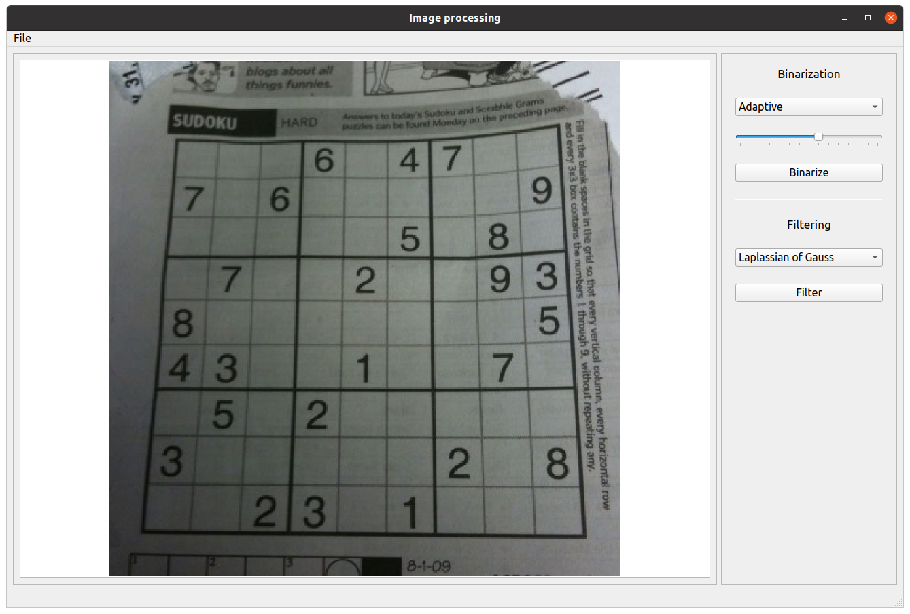
На картинке видно, что левый угол немного темнее остальной части и при использовании глобальной бинаризации мы бы
получили только половину нормального изображения. Не справились бы хорошо и локальные методы, поскольку внутри квадратов
все практически однотонное. Зато отлично работает адаптивный метод:
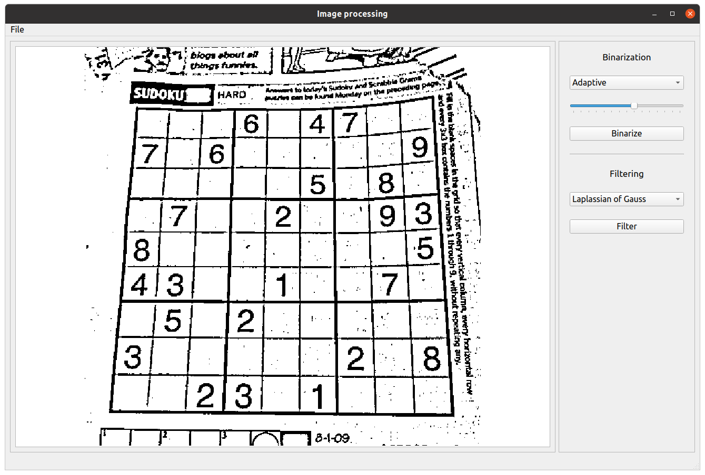

##### Локальные методы

В некоторых случаях локальные методы проявляют себя лучше адаптивного, а также требует меньших усилий по подбору
параметров. Тут, правда, возникает еще одна проблема: непонятно как именно оценивать работу метода бинаризации,
поскольку иногда они дают совсем уж разный результат.
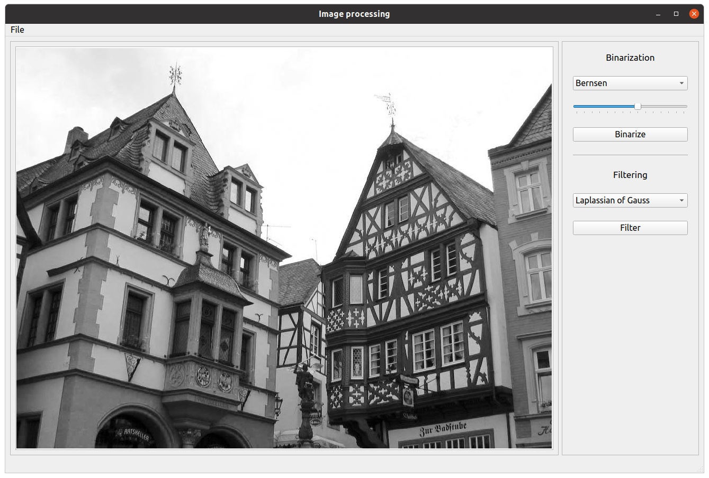
Практически отлично справляется здесь метод Бернсена
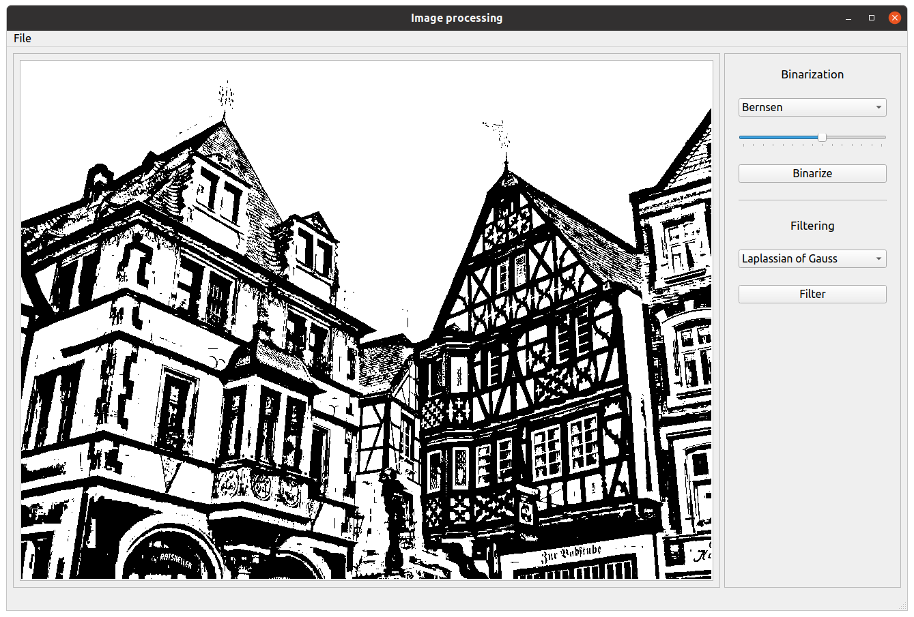
Метод Ниблака тут даёт странные артефакты
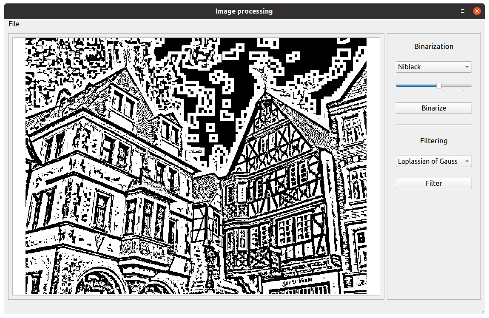

Еще интересные результаты получились для такой картинки:
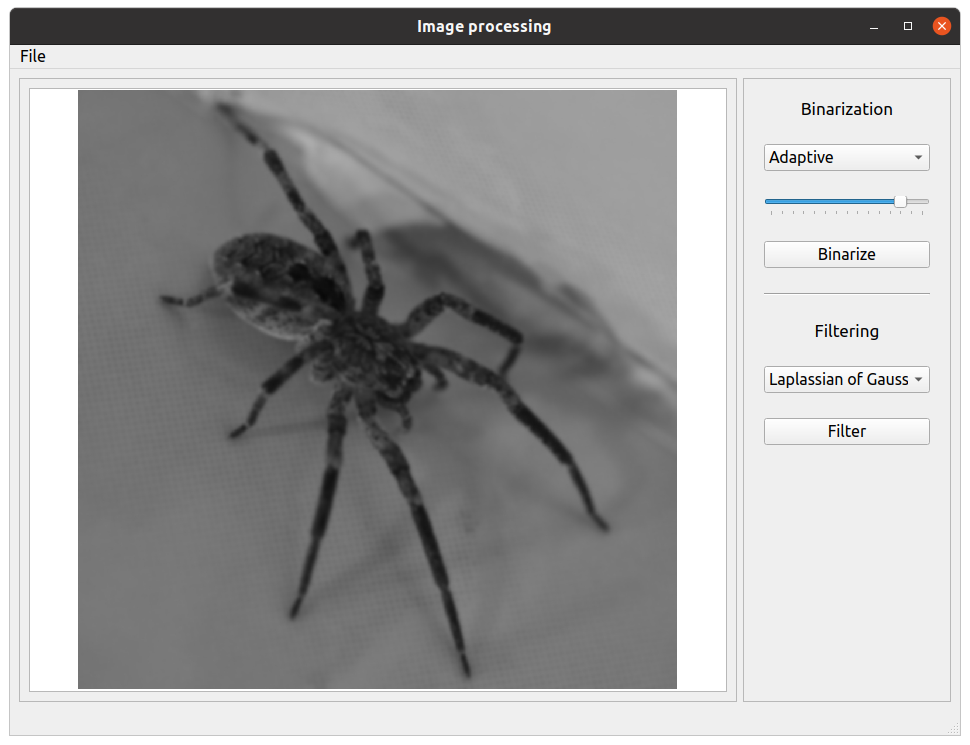
Адаптивный метод тут хорошо выделяет границы
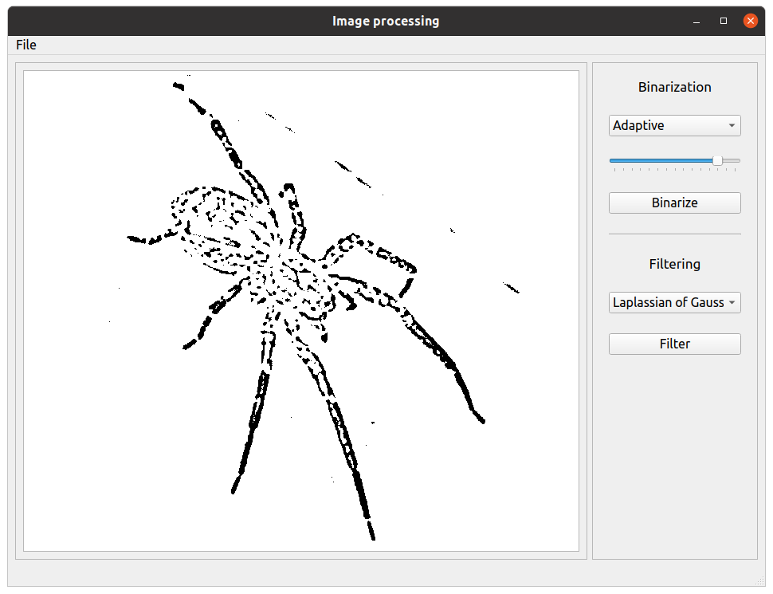
А вот Бернсен, как по мне, работает даже лучше (хоть и инвертирует цвета)
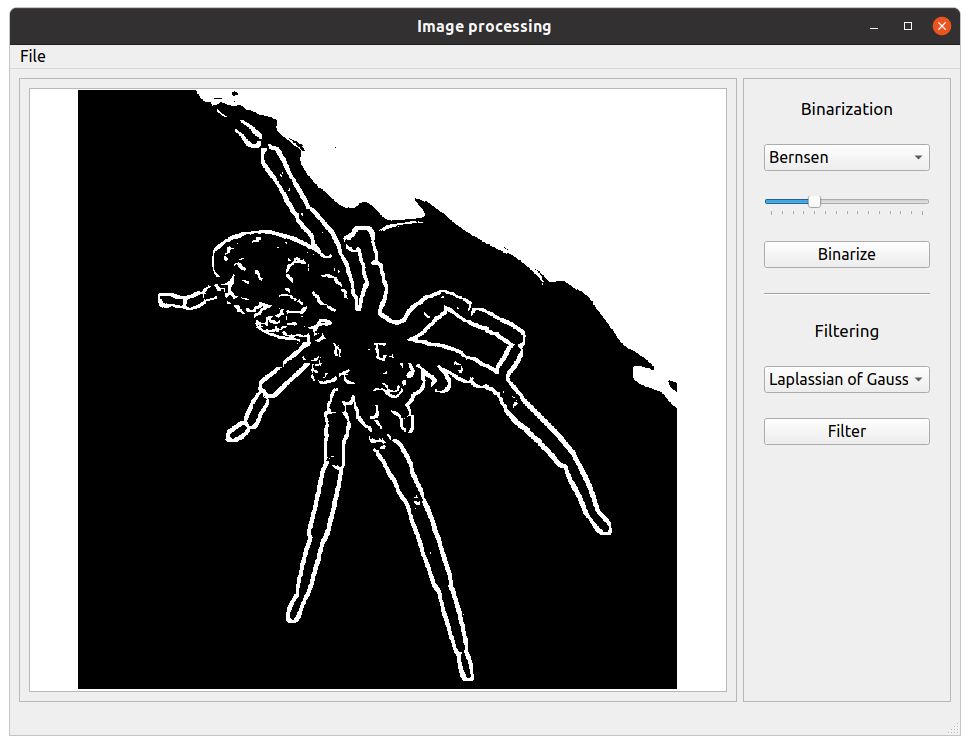
У Ниблака, как обычно
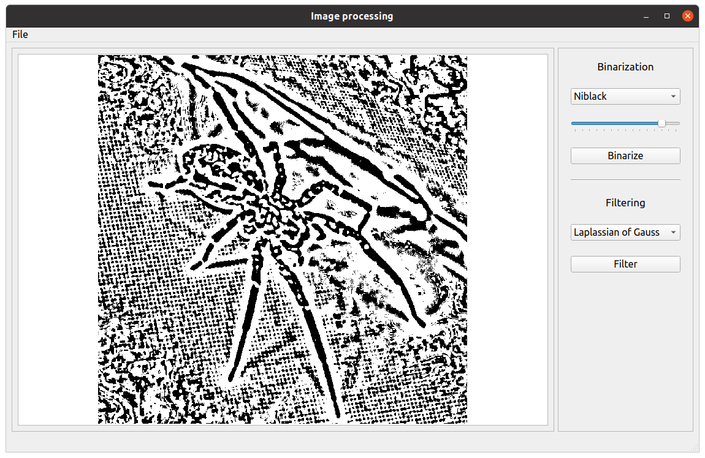

### Высокочастотные фильтры

Я пробовал разные фильтры, но каких-то сильно различных результатов не было. В целом для размытых фотографий результат
практически всегда хорошо, если же деталей много или изображение изначально чёткое, то получается так себе. Появляется
ореол вокруг краёв и картинка сильно портится.

#### Лапласиан

Изначальное изображение слегка замылено

Применяем фильтр и получаем уже неплохой результат:
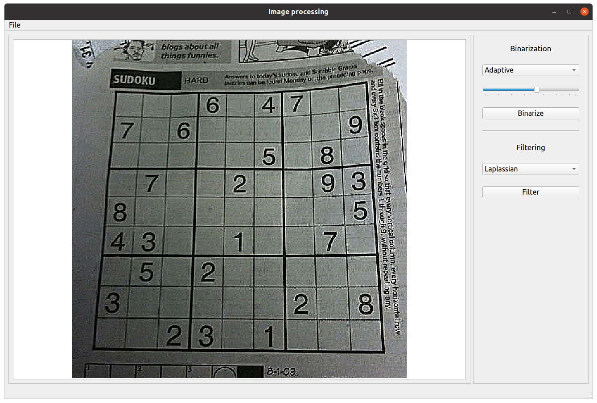

#### LoG

Не совсем то, что просилось в задании, но картинки прикольные

После применения Лапласиана Гауссиана
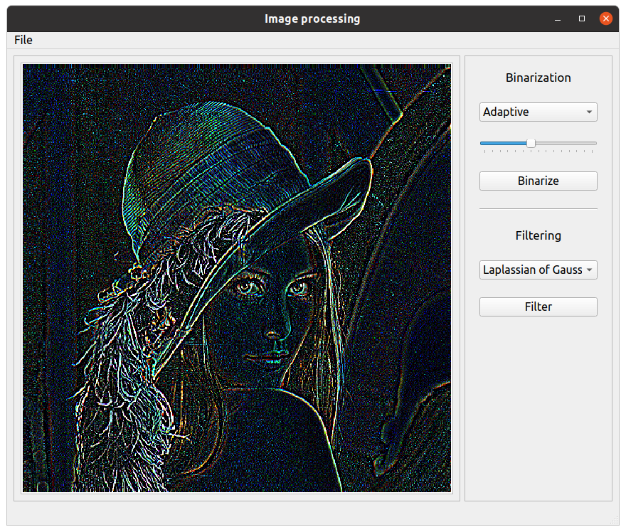
